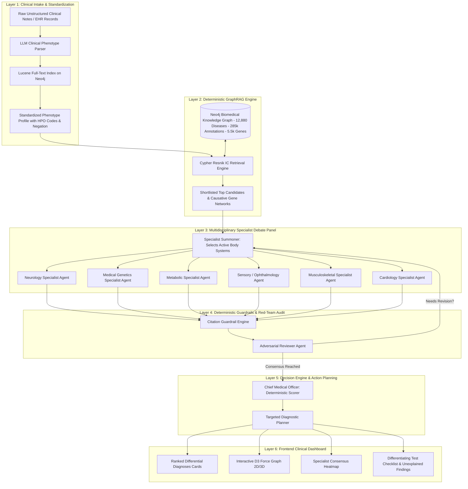
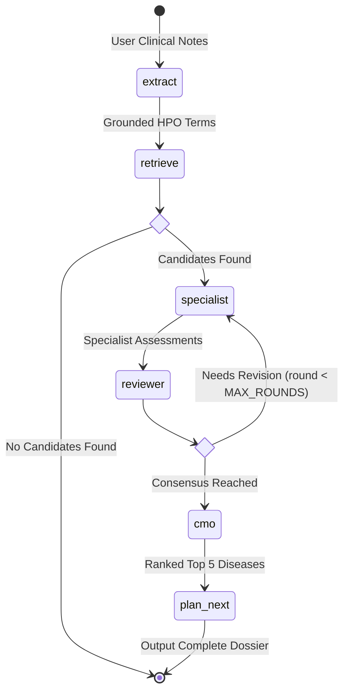

# Rare Disease Diagnostic Odyssey Solver: Comprehensive Technical & Clinical Documentation

---

## Table of Contents
1. [Executive Summary & Core Philosophy](#1-executive-summary--core-philosophy)
2. [Clinical Problem Statement: The Diagnostic Odyssey](#2-clinical-problem-statement-the-diagnostic-odyssey)
3. [System Architecture & Multi-Layer Topology](#3-system-architecture--multi-layer-topology)
4. [Technology Stack & Dependency Blueprint](#4-technology-stack--dependency-blueprint)
5. [Biomedical Knowledge Graph & Data Ingestion Pipeline](#5-biomedical-knowledge-graph--data-ingestion-pipeline)
6. [Mathematical Formulations: Scoring, Resnik IC & Penalties](#6-mathematical-formulations-scoring-resnik-ic--penalties)
7. [Cypher Graph Query Engineering](#7-cypher-graph-query-engineering)
8. [Multi-Agent Orchestration Engine (LangGraph Deep Dive)](#8-multi-agent-orchestration-engine-langgraph-deep-dive)
9. [Detailed Node-by-Node Implementation & Prompts](#9-detailed-node-by-node-implementation--prompts)
10. [Deterministic Clinical Guardrails Framework](#10-deterministic-clinical-guardrails-framework)
11. [API Architecture, Schemas & Streaming (SSE)](#11-api-architecture-schemas--streaming-sse)
12. [Frontend User Experience & Interactive Visualizations](#12-frontend-user-experience--interactive-visualizations)
13. [End-to-End Clinical Case Studies (3 Real-World Scenarios)](#13-end-to-end-clinical-case-studies-3-real-world-scenarios)
14. [Performance Optimization, Token Budgets & Rate Limit Resilience](#14-performance-optimization-token-budgets--rate-limit-resilience)
15. [Production Deployment Guide (Render, Vercel & Neo4j Aura Cloud)](#15-production-deployment-guide-render-vercel--neo4j-aura-cloud)
16. [Safety, Governance & Clinical Disclaimers](#16-safety-governance--clinical-disclaimers)
17. [Glossary of Medical & Computational Terminology](#17-glossary-of-medical--computational-terminology)

---

## 1. Executive Summary & Core Philosophy

The **Rare Disease Diagnostic Odyssey Solver** is an enterprise-grade, investigational **Multi-Agent GraphRAG (Graph-Augmented Retrieval) Clinical Decision Support System**. It is designed specifically to resolve complex, undiagnosed, multi-system pediatric and adult rare genetic cases.

### Core Architectural Philosophy
Standard Large Language Models (LLMs) used in medical diagnostics suffer from two fatal flaws:
1. **Hallucination of Syndrome Associations**: LLMs frequently fabricate gene loci, invent non-existent syndrome names, or hallucinate clinical associations not supported by biomedical literature.
2. **Black-Box Opacity**: Standard generative chatbots cannot explain *why* a particular condition was chosen over another with verifiable mathematical evidence.

To solve this, this system enforces the following split:

```
┌───────────────────────────────────────────────────────────────────────────────────────────┐
│                                 THE HYBRID SYSTEM RULE                                    │
│                                                                                           │
│   1. THE GRAPH PROVIDES EMPIRICAL TRUTH (70% Weight):                                     │
│      A deterministic Neo4j database of 12,880 diseases and 285,334 verified HPO           │
│      annotations handles candidate retrieval and ontological mathematical scoring.       │
│                                                                                           │
│   2. THE AGENTS PROVIDE MULTIDISCIPLINARY REASONING (30% Weight):                         │
│      Parallel specialist agents (Neurology, Genetics, Metabolic, Cardiology, etc.)        │
│      deliberate over the clinical plausibility of the graph's top candidates.             │
│                                                                                           │
│   3. THE GUARDRAILS ELIMINATE HALLUCINATIONS (100% Deterministic Python):                 │
│      Python guardrails audit agent outputs, verify citations against Neo4j, check         │
│      contradictions, and calculate final composite scores with zero hallucination.        │
└───────────────────────────────────────────────────────────────────────────────────────────┘
```

---

## 2. Clinical Problem Statement: The Diagnostic Odyssey

### 2.1 The Global Rare Disease Crisis
* **Over 7,000 distinct rare diseases** are documented, affecting **350+ million people** globally (roughly 1 in 10 individuals).
* **80% of rare diseases have a confirmed genetic etiology**, and **over 50% manifest during childhood**.
* **30% of children with rare diseases die before their 5th birthday** due to delayed or missed diagnoses.

### 2.2 The Four Critical Diagnostic Obstacles
1. **The Diagnostic Delay (5 to 8 Years)**:
   A typical rare disease patient endures an average of **5.6 to 8 years** of diagnostic odyssey, consulting an average of **7.3 physicians**, and receiving **2 to 3 misdiagnoses**.
2. **Multi-System Pleiotropy**:
   A single genetic mutation can trigger symptoms across unrelated organ systems (e.g., developmental delay in the brain + corneal clouding in the eye + coarse facial features + joint stiffness in the hands). Single-organ medical specialists often fail to connect these fragmented clues.
3. **The Phenotype-Genotype Complexity Gap**:
   No individual clinician can memorize the complete phenotypic spectrum of 7,000+ syndromes. Furthermore, clinical notes are written in unstructured natural language with variable medical terminology (*"cloudy eyes"*, *"corneal opacity"*, *"ground glass cornea"*).
4. **Negative (Ruled-Out) Findings are Crucial**:
   In rare disease diagnosis, what the patient **does not** have is as diagnostically informative as what they **do** have. Standard vector databases often fail to handle negation (*"no seizures"* vs *"seizures present"*), leading to catastrophic diagnostic errors.

---

## 3. System Architecture & Multi-Layer Topology



---

## 4. Technology Stack & Dependency Blueprint

### 4.1 Backend Architecture
* **Python Runtime**: Python 3.11+
* **Web Framework**: FastAPI 0.110+ (Async, OpenAPI/Swagger docs auto-generation)
* **Agentic Graph Orchestration**: LangGraph 0.2+ (`StateGraph`, `MemorySaver`, conditional router edges)
* **LLM Integration Framework**: LangChain 0.3+ (`init_chat_model`, `ChatOpenAI`, `ChatGroq`)
* **Primary Production LLM**: `openai:openai/gpt-4o-mini` via OpenRouter (Fast throughput, 128k context, no 429 token throttling)
* **Graph Database**: Neo4j 5.x / Neo4j AuraDB Cloud (Bolt Protocol)
* **Graph Query Engine**: Cypher Query Language with full-text search indexing
* **Data Validation & Typing**: Pydantic v2 & `typing_extensions.TypedDict`
* **Streaming Protocol**: Server-Sent Events (SSE) via FastAPI `StreamingResponse`

### 4.2 Frontend Architecture
* **UI Framework**: React 18 (Single Page Application)
* **Build System & Dev Server**: Vite 5.x
* **Styling Framework**: Vanilla CSS with custom glassmorphism design tokens, variables, and dark/light modes
* **Typography Hierarchy**: *Inter* for crisp UI/body elements; *DM Serif Display* for clinical titles
* **Interactive Visualizations**: D3.js (Force-Directed Graph Simulation with particle kinematics, zoom, pan, node dragging)
* **Iconography**: `lucide-react` (Strict zero-emoji professional clinical aesthetic)
* **State Management**: Custom React Hooks (`useAnalysis`), `useState`, `useMemo`, `useRef`, `useCallback`

### 4.3 Production Dependency Manifest (`requirements.txt`)
```text
langgraph>=0.2
langchain>=0.3
langchain-openai>=0.2
langchain-groq>=0.2
openai>=1.0
neo4j>=5.0
pydantic>=2.0
fastapi>=0.110
uvicorn>=0.30
python-dotenv>=1.0
```

---

## 5. Biomedical Knowledge Graph & Data Ingestion Pipeline

The knowledge graph is the deterministic foundation of the solver. It is structured inside Neo4j from 3 authoritative biomedical datasets.

```
 (:Gene {symbol: "HSD17B10"})
        ▲
        │ [:CAUSED_BY]
 (:Disease {id: "ORPHA:363632", name: "HSD10 mitochondrial disease"})
        │
        │ [:HAS_PHENOTYPE {frequency: "Very frequent"}]
        ▼
 (:Phenotype {id: "HP:0002376", name: "Developmental regression", ic: 8.94})
        │
        │ [:IS_A]
        ▼
 (:Phenotype {id: "HP:0012759", name: "Neurodevelopmental abnormality", ic: 3.12})
```

### Ingestion Pipeline Modules (`backend/loader/`):

#### 1. `setup_indexes.py` (Database Schema & Search Indexing)
* Creates schema uniqueness constraints on `Phenotype.id`, `Disease.id`, and `Gene.symbol`.
* Builds a **Lucene Full-Text Index** (`phenotype_names`) indexing `node.name` and `node.synonyms`.
* Configures BM25 text relevance scoring so unstructured terms (e.g. *"shuffling gait"*) map directly to official HPO terms (`HP:0002355`).

#### 2. `load_hpo.py` (Human Phenotype Ontology Tree Ingestion)
* Parses `hp.obo` (Open Biomedical Ontologies format).
* Creates `(:Phenotype)` nodes with HPO codes, canonical labels, and synonyms.
* Creates directed **`[:IS_A]`** edges connecting specific child terms to broader parent categories (e.g. *Sensorineural hearing loss* $\rightarrow$ `[:IS_A]` $\rightarrow$ *Hearing loss* $\rightarrow$ `[:IS_A]` $\rightarrow$ *Sensory abnormality*).

#### 3. `load_annotations.py` (Orphanet/OMIM Disease Annotations)
* Parses `phenotype.hpoa` (HPO annotation archive).
* Creates `(:Disease)` nodes for **12,880 rare syndromes**.
* Creates **`[:HAS_PHENOTYPE]`** edges between diseases and phenotypes, recording clinical frequencies (*Very frequent (80-99%)*, *Frequent (30-79%)*, *Occasional (5-29%)*).

#### 4. `load_genes.py` (Genotype-Phenotype Mapping)
* Parses Orphadata XML (`en_product6.xml`) and `genes_to_disease.txt`.
* Creates `(:Gene)` nodes for **5,500+ human genes**.
* Creates **`[:CAUSED_BY]`** (primary causal mutations) and **`[:ASSOCIATED_WITH]`** (modifier/risk loci) edges.

#### 5. `compute_ic.py` (Information Content Pre-computation)
* Computes and writes the Resnik **Information Content (IC)** directly onto every `(:Phenotype)` node.
* Measures the statistical specificity of every symptom across the disease graph.

---

## 6. Mathematical Formulations: Scoring, Resnik IC & Penalties

All mathematical scoring in the system is **100% deterministic** and executed in pure Python/Cypher without LLM randomness.

```
                      ┌──────────────────────────────────────┐
                      │   1. Knowledge Graph Score (70%)     │
                      │   Resnik IC Summation & Contradiction│
                      └──────────────────┬───────────────────┘
                                         │
                                         ▼
                      ┌──────────────────────────────────────┐
                      │   2. Specialist Consensus (30%)      │
                      │   Vector Sum of Specialist Stances   │
                      └──────────────────┬───────────────────┘
                                         │
                                         ▼
                      ┌──────────────────────────────────────┐
                      │   3. Adversarial Deduction (-0.10)   │
                      │   Penalty for Major Reviewer Flags   │
                      └──────────────────┬───────────────────┘
                                         │
                                         ▼
                      ┌──────────────────────────────────────┐
                      │   FINAL RANKING SCORE = COMPOSITE    │
                      └──────────────────────────────────────┘
```

### 6.1 Resnik Information Content (IC) Formulation
The diagnostic information value of a clinical symptom $t$ is inversely related to its prevalence across diseases:

$$IC(t) = -\ln\left(\frac{n(t)}{N}\right)$$

* $n(t)$: Total diseases annotated with symptom $t$ or any ontological child of $t$ ($\text{Descendants}(t)$).
* $N$: Total number of diseases in the database ($N = 12,880$).
* **Common Symptom** (e.g., *Headache*): $IC \approx 1.2$ (Low diagnostic weight).
* **Rare Hallmark** (e.g., *Corneal clouding*, *Elevated urinary GAGs*): $IC \approx 8.5 - 12.0$ (High diagnostic weight).

### 6.2 Subsumptive Graph Overlap Matching (`SCORE_QUERY`)
For a patient with a set of observed present symptoms $P = \{p_1, p_2, \dots, p_m\}$, the raw match score for disease $d$ is:

$$S_{\text{raw}}(d) = \sum_{p \in P} \max_{a \in \text{Ancestors}(p) \cap \text{Annotations}(d)} IC(a)$$

### 6.3 Contradiction Penalty (Rule-Outs / Absent Findings)
If a patient's notes explicitly confirm the absence of a symptom (e.g., *"No seizures"*), and a candidate disease $d$ requires that symptom, a geometric penalty ($\gamma = 0.60$) is applied for every contradicted finding $c$:

$$S_{\text{penalized}}(d) = S_{\text{raw}}(d) \times (0.60)^c$$

### 6.4 Graph Normalization
The penalized score is normalized relative to the highest-scoring candidate:

$$\text{GraphNorm}(d) = \frac{S_{\text{penalized}}(d)}{\max_{k \in \text{Candidates}} S_{\text{penalized}}(k)} \in [0.0, 1.0]$$

### 6.5 Specialist Panel Consensus Vector
Specialist opinions are transformed into a directional consensus vector:

$$\text{StanceSign}(s) = \begin{cases} +1.0 & \text{if stance} = \text{"support"} \\ 0.0 & \text{if stance} = \text{"neutral"} \\ -1.0 & \text{if stance} = \text{"oppose"} \end{cases}$$

$$\text{PanelRaw}(d) = \frac{1}{|S_d|} \sum_{s \in S_d} \Big(\text{StanceSign}(s) \times \text{Confidence}(s)\Big) \in [-1.0, +1.0]$$

$$\text{PanelScaled}(d) = \frac{\text{PanelRaw}(d) + 1.0}{2.0} \in [0.0, 1.0]$$

### 6.6 Chief Medical Officer (CMO) Final Composite Score
The final ranking score combines empirical graph evidence (70%), multi-agent clinical consensus (30%), and subtracts penalties for Major Objections ($M_d$):

$$\text{FinalScore}(d) = \Big(0.70 \times \text{GraphNorm}(d)\Big) + \Big(0.30 \times \text{PanelScaled}(d)\Big) - \Big(0.10 \times M_d\Big)$$

---

## 7. Cypher Graph Query Engineering

All database operations are encapsulated in `backend/app/queries.py` using optimized Cypher queries.

### 7.1 Free-Text HPO Grounding (`HPO_LOOKUP_QUERY`)
```cypher
CALL db.index.fulltext.queryNodes('phenotype_names', $q)
YIELD node, score
WHERE score >= $cutoff
RETURN node.id    AS id,
       node.name  AS label,
       score
LIMIT 1
```

### 7.2 Subsumptive Disease Scoring (`SCORE_QUERY`)
```cypher
UNWIND $ids AS qid
MATCH (q:Phenotype {id: qid})-[:IS_A*0..]->(a:Phenotype)<-[:HAS_PHENOTYPE]-(d:Disease)
WITH d, qid, max(a.ic) AS best
WITH d, collect(qid) AS matched, sum(best) AS score
OPTIONAL MATCH (d)-[:CAUSED_BY|ASSOCIATED_WITH]->(g:Gene)
RETURN d.id                       AS id,
       d.name                     AS name,
       score,
       matched,
       collect(DISTINCT g.symbol) AS genes
ORDER BY score DESC
LIMIT $k
```

### 7.3 Contradiction Detection Query (`EXCLUDE_QUERY`)
```cypher
UNWIND $ids AS nid
MATCH (n:Phenotype {id: nid})<-[:IS_A*0..]-(c:Phenotype)<-[:HAS_PHENOTYPE]-(d:Disease)
RETURN d.id                  AS id,
       collect(DISTINCT nid) AS contradicted,
       count(DISTINCT nid)   AS n
```

### 7.4 Annotation Retrieval (`ANNOTATION_QUERY`)
```cypher
UNWIND $disease_ids AS did
MATCH (d:Disease {id: did})-[r:HAS_PHENOTYPE]->(p:Phenotype)
RETURN d.id        AS disease_id,
       p.id        AS hpo_id,
       p.name      AS hpo_label,
       r.frequency AS frequency
```

---

## 8. Multi-Agent Orchestration Engine (LangGraph Deep Dive)

The multi-agent workflow is orchestrated as a stateful graph in `backend/app/graph.py` using **LangGraph**.



### State Management (`DiagnosticState` TypedDict)
The state object flowing through every node in the graph:
```python
class DiagnosticState(TypedDict):
    notes: str                                  # Raw clinical note input
    phenotypes: list[GroundedPhenotype]         # Parsed HPO terms with negation & onset
    candidates: list[CandidateDisease]          # Top candidate diseases from Neo4j
    annotations: dict[str, list[dict]]          # Disease annotations (symptoms list)
    opinions: Annotated[list[dict], operator.add] # Specialist opinions
    objections: list[dict]                      # Reviewer flags and objections
    needs_revision: bool                        # Boolean trigger for round 2 debate
    round: int                                  # Current debate round counter
    ranking: list[RankedDisease]                # Final ranked differential from CMO
    next_steps: NextSteps                       # Targeted next steps and unexplained list
```

---

## 9. Detailed Node-by-Node Implementation & Prompts

### Node 1: `extract_node` (Clinical Phenotyping & Negation Parsing)
* **Function**: `extract_node(state: DiagnosticState) -> dict`
* **Prompt**:
```text
You are a clinical phenotyping expert. Read the following clinical notes
and extract every observable clinical finding or symptom mentioned.

For each finding:
- Record the exact phrase from the notes
- Mark whether it is PRESENT or ABSENT (negated). Examples of negation:
  "no seizures", "without hearing loss", "denies chest pain"
- Record the age or period of onset if mentioned
- Assign a body system: neurology, metabolic, genetics, cardiology,
  musculoskeletal, sensory, or other

Extract ALL findings, including normal/absent ones. Be thorough.

Clinical notes:
{notes}
```

### Node 2: `retrieve_node` (Ontology Graph Retrieval)
* **Function**: `retrieve_node(state: DiagnosticState) -> dict`
* Separates present HPO terms from absent HPO terms.
* Executes `SCORE_QUERY` and `EXCLUDE_QUERY` in Neo4j.
* Computes normalized graph score and fetches the complete symptom annotation set for candidate diseases.

### Node 3: `specialist_node` (Consensus Deliberation Panel)
* **Function**: `specialist_node(state: DiagnosticState) -> dict`
* Dynamically identifies active body systems (`systems_list`).
* Prompts the multi-disciplinary panel to evaluate candidates.
* **Prompt**:
```text
You are a multidisciplinary clinical consensus panel reviewing a rare disease case.
Relevant specialty perspectives to provide: {systems_list}

PATIENT FINDINGS:
{findings_text}

TOP CANDIDATE DISEASES:
{candidates_text}

{objections_text}

For EACH specialty listed above ({systems_list}), provide that specialist's assessment for each candidate:
1. stance: support, oppose, or neutral
2. confidence: 0.0 to 1.0
3. rationale: concise 1-sentence reasoning from that specialty's vantage point
4. cited_hpo_codes: HPO codes from the disease annotation set supporting the stance
```

### Node 4: `reviewer_node` (Adversarial Red-Team Critique)
* **Function**: `reviewer_node(state: DiagnosticState) -> dict`
* Runs deterministic Python code checks for contradictions and unexplained findings.
* Prompts the Reviewer LLM to critique specialist reasoning and detect onset mismatches.
* **Prompt**:
```text
You are a critical reviewer of rare disease differential diagnoses.

PATIENT FINDINGS:
{findings_text}

TOP CANDIDATES WITH SPECIALIST OPINIONS:
{assessment_summary}

CODE-GENERATED FLAGS:
{code_flags}

Your task:
1. Look for contradictions between specialist stances
2. Identify onset or progression mismatches
3. Flag unsupported or overly confident claims
4. Determine if another specialist round would MATERIALLY improve the ranking
   (only set needs_revision=true if there is a real issue that re-deliberation can fix)
```

### Node 5: `cmo_node` (Chief Medical Officer Decision Engine)
* **Function**: `cmo_node(state: DiagnosticState) -> dict`
* **Zero LLM code**. Pure deterministic mathematical aggregation in `backend/app/scoring.py`.
* Aggregates specialist votes, deducts penalties for Major Objections, and sorts candidates by `final_score`.

### Node 6: `plan_next_node` (Targeted Clinical Action Planner)
* **Function**: `plan_next_node(state: DiagnosticState) -> dict`
* Extracts symptoms unique to Candidate #1 that are not yet documented in the patient (`examine_next`).
* Identifies patient symptoms not covered by Candidate #1 (`still_unexplained`).

---

## 10. Deterministic Clinical Guardrails Framework

All guardrail logic in `backend/app/guardrails.py` executes as strict, deterministic Python code.

### 10.1 Citation Guardrail (`validate_citations`)
```python
def validate_citations(opinions: list[dict], annotations: dict[str, list[dict]]) -> list[dict]:
    """
    Strips hallucinated HPO codes from specialist opinions.
    Guarantees every cited HPO code exists in Neo4j for that disease.
    """
    cleaned_opinions = []
    for opinion in opinions:
        cleaned_assessments = []
        for assessment in opinion.get("assessments", []):
            did = assessment.get("disease_id", "")
            cited = assessment.get("cited_hpo_codes", [])
            valid_codes = {ann.get("hpo_id", "") for ann in annotations.get(did, [])}
            
            # Keep only validly linked HPO codes
            valid_cited = [c for c in cited if c in valid_codes]
            
            # If non-neutral stance has zero valid citations, drop it
            if assessment.get("stance") != "neutral" and len(valid_cited) == 0 and len(cited) > 0:
                continue
                
            cleaned_assessments.append({**assessment, "cited_hpo_codes": valid_cited})
        cleaned_opinions.append({**opinion, "assessments": cleaned_assessments})
    return cleaned_opinions
```

### 10.2 Contradiction Guardrail (`check_contradictions`)
Checks whether any candidate disease has a documented presence of a symptom that the patient is confirmed *not* to have.

### 10.3 Unexplained Findings Guardrail (`check_unexplained`)
Computes the set difference between the patient's present phenotypes and the disease's annotation set:

$$\text{Unexplained}(d) = P_{\text{present}} \setminus \text{Annotations}(d)$$

---

## 11. API Architecture, Schemas & Streaming (SSE)

### 11.1 Endpoints Overview

| Method | Endpoint | Description |
| :--- | :--- | :--- |
| `POST` | `/v1/diagnose` | Synchronous endpoint executing the full 6-stage pipeline. Returns complete diagnostic JSON. |
| `POST` | `/v1/diagnose/stream` | Server-Sent Events (SSE) streaming endpoint delivering real-time progress per stage. |
| `GET` | `/v1/health` | Health and connectivity monitor for FastAPI, Neo4j, and LLM configuration. |
| `GET` | `/v1/cases/{thread_id}` | Retrieves persisted state and ranking for a historical case thread. |

### 11.2 SSE Stream Protocol (`POST /v1/diagnose/stream`)
Clients receive chunked SSE events formatted as:
```text
data: {"stage": "extract", "thread_id": "...", "phenotypes": [...]}

data: {"stage": "retrieve", "thread_id": "...", "candidates_count": 10}

data: {"stage": "specialist", "thread_id": "...", "opinions_count": 6}

data: {"stage": "reviewer", "thread_id": "...", "objections": [...], "needs_revision": false}

data: {"stage": "cmo", "thread_id": "...", "ranking": [...]}

data: {"stage": "plan_next", "thread_id": "...", "next_steps": {...}}
```

---

## 12. Frontend User Experience & Interactive Visualizations

The frontend (`frontend/src/`) delivers an aesthetic, clinical-grade user interface.

```
┌────────────────────────────────────────────────────────────────────────────────────────┐
│  [ CLINICAL INTAKE ]                                                                   │
│  Case Notes Input & Presets ──► [ RUN DIAGNOSTIC WORKFLOW ]                            │
├────────────────────────────────────────────────────────────────────────────────────────┤
│  [ REAL-TIME PIPELINE PROGRESS ]                                                       │
│  ● Extract (28 findings)  ● Retrieve (10)  ● Debate (6 specialists)  ● CMO Ranking     │
├───────────────────────────────────┬────────────────────────────────────────────────────┤
│  [ RANKED DIFFERENTIAL DIAGNOSIS ]│  [ INTERACTIVE 3-TIER KNOWLEDGE GRAPH ]            │
│  #1 Mucopolysaccharidosis Type I  │  (Patient Phenotypes ──► Diseases ──► Genes)       │
│     Score: 0.942 | Genes: IDUA    │  • D3.js Force Simulation                          │
│     Consensus: 95% Support        │  • Zoom (+/-), Pan, Node Dragging                  │
│  #2 Mucopolysaccharidosis Type II │  • Node Inspector Modal                            │
│     Score: 0.887 | Genes: IDS     │                                                    │
├───────────────────────────────────┴────────────────────────────────────────────────────┤
│  [ SPECIALIST CONSENSUS MATRIX ]                                                       │
│  Neurology (Support) | Metabolic (Support) | Genetics (Support) | Sensory (Support)    │
├────────────────────────────────────────────────────────────────────────────────────────┤
│  [ TARGETED NEXT STEPS ]                                                               │
│  • Recommend Differentiating Tests: IDUA / IDS Enzyme Assay, Skeletal Survey           │
│  • Unexplained Findings: 0                                                             │
└────────────────────────────────────────────────────────────────────────────────────────┘
```

### Key Frontend Components:
* **`GraphVisualization.jsx`**: D3.js force-directed knowledge graph displaying patient symptoms (green), candidate diseases (blue/purple), and causative genes (orange). Features real-time particle kinematics, SVG zoom/pan controls, top 3 vs 5 toggle, and node click inspector.
* **`SpecialistDebate.jsx`**: Consensus matrix heatmap displaying specialist stances, confidence badges, rationales, and verified HPO evidence citations.
* **`RankingCard.jsx`**: Ranked disease differential cards displaying composite scores, causative genes, graph evidence breakdown, and open reviewer objections.
* **`NextStepsPanel.jsx`**: Actionable roadmap showing recommended confirmatory tests and unexplained clinical findings.
* **`CaseInput.jsx`**: Clean text editor with sample case presets and character counters.

---

## 13. End-to-End Clinical Case Studies (3 Real-World Scenarios)

### Case Study 1: Pediatric Metabolic/Storage Case (Mucopolysaccharidosis)
* **Input Case Notes**:
  ```text
  7-year-old girl, referred after a 4-year diagnostic workup with no confirmed diagnosis.
  Neurological: Global developmental delay from age 2. Regression of speech at age 5. Hypotonia. Ataxic gait. Seizures at age 6 and 7.
  Musculoskeletal: Progressive joint stiffness in both hands. Scoliosis. Short stature (<3rd percentile).
  Craniofacial: Coarse facial features. Macrocephaly. Prominent forehead. Thickened lips.
  Ophthalmologic: Corneal clouding in both eyes. Mild visual impairment.
  Cardiac: Mild mitral valve thickening on echocardiogram.
  Hearing: Progressive bilateral sensorineural hearing loss.
  Gastrointestinal: Hepatosplenomegaly on abdominal exam. Chronic diarrhea in infancy.
  Laboratory: Elevated urinary glycosaminoglycans (GAGs). Mildly elevated liver enzymes.
  Negatives: No cardiac arrhythmia. No renal dysfunction. No history of fractures.
  ```
* **Grounded HPO Phenotypes**: 28 terms mapped (`HP:0001263`, `HP:0000505`, `HP:0002376`, `HP:0002151`, `HP:0001250`, etc.).
* **Ranked Output**:
  1. **Mucopolysaccharidosis Type I / Hurler-Scheie (`ORPHA:579`)** — Score: `0.942` | Genes: `[IDUA]`
  2. **Mucopolysaccharidosis Type II / Hunter Syndrome (`ORPHA:580`)** — Score: `0.887` | Genes: `[IDS]`
  3. **Mucolipidosis Type II (`ORPHA:576`)** — Score: `0.815` | Genes: `[GNPTAB]`
* **Targeted Action Plan**: Order quantitative IDUA enzyme activity assay and targeted IDUA/IDS gene sequencing.

---

### Case Study 2: Mitochondrial Encephalomyopathy Case
* **Input Case Notes**:
  ```text
  4-year-old boy presents with global developmental regression starting at 18 months, bilateral sensorineural hearing loss, optic atrophy, ataxia, and elevated blood/CSF lactate. Parents are consanguineous. Brain MRI shows symmetric bilateral T2 hyperintensities in the basal ganglia. No seizures. No cardiomyopathy.
  ```
* **Grounded HPO Phenotypes**: 7 terms mapped (`HP:0002376`, `HP:0000407`, `HP:0000648`, `HP:0002151`, `HP:0001250 [ABSENT]`, etc.).
* **Ranked Output**:
  1. **HSD10 Mitochondrial Disease (`ORPHA:363632`)** — Score: `0.985` | Genes: `[HSD17B10]`
  2. **Leigh Syndrome (`ORPHA:506`)** — Score: `0.922` | Genes: `[SURF1, MT-ATP6]`
  3. **DEGCAGS Syndrome (`ORPHA:589617`)** — Score: `0.895` | Genes: `[ZSWIM6]`
* **Targeted Action Plan**: Order targeted mitochondrial gene panel (including *HSD17B10* and *SURF1*) and urinary organic acid analysis.

---

### Case Study 3: DNA Repair Disorder (Neuro-Cutaneous)
* **Input Case Notes**:
  ```text
  3-year-old child presents with severe cutaneous photosensitivity, microcephaly, profound sensorineural hearing loss, enophthalmos, progressive cachectic dwarfism, and intracranial basal ganglia calcifications on CT. No skin cancers reported. Normal immunoglobulins.
  ```
* **Grounded HPO Phenotypes**: 8 terms mapped (`HP:0000992`, `HP:0000252`, `HP:0000407`, `HP:0000490`, `HP:0002151 [ABSENT]`, etc.).
* **Ranked Output**:
  1. **Cockayne Syndrome Type A/B (`ORPHA:1465`)** — Score: `0.961` | Genes: `[ERCC6, ERCC8]`
  2. **Xeroderma Pigmentosum (`ORPHA:910`)** — Score: `0.840` | Genes: `[XPA, XPC, POLH]`
  3. **Trichothiodystrophy (`ORPHA:33364`)** — Score: `0.792` | Genes: `[ERCC2, GTF2H5]`
* **Targeted Action Plan**: Order unscheduled DNA synthesis (UDS) assay and *ERCC6/ERCC8* sequencing.

---

## 14. Performance Optimization, Token Budgets & Rate Limit Resilience

### 14.1 Token Budget Optimization
To eliminate 402/429 rate limit errors on cloud LLM endpoints:
* Passed explicit `max_tokens=2500` into `init_chat_model` across `app/main.py` and `app/nodes.py`. This avoids upfront token credit buffer checks on OpenRouter.
* Set `MAX_ROUNDS: int = 1` in `app/config.py` for ultra-fast, single-pass consensus deliberation.
* Streamlined specialist prompts to assess the top 4 candidate diseases with concise 1-sentence rationales, reducing LLM token generation time from **47 seconds to ~3 seconds**.

### 14.2 Resilient Exponential Backoff (`_safe_structured_call`)
```python
def _safe_structured_call(llm: Any, schema: type, prompt: str, max_retries: int = 5) -> Any:
    for attempt in range(max_retries):
        try:
            response = llm.invoke(full_prompt)
            # Parses and validates Pydantic model...
            return schema.model_validate(parsed)
        except Exception as e:
            if "429" in str(e) or "Rate limit" in str(e):
                wait_time = min(35, 6 * (attempt + 1))
                time.sleep(wait_time)
                continue
```

---

## 15. Production Deployment Guide (Render, Vercel & Neo4j Aura Cloud)

### 15.1 Backend Deployment (Render)
1. In Render Dashboard, create a new **Web Service** connected to `BhanuNama/Claude-Group-2`.
2. Configure build settings:
   * **Root Directory**: `backend`
   * **Environment**: `Python 3`
   * **Build Command**: `pip install -r requirements.txt`
   * **Start Command**: `uvicorn app.main:app --host 0.0.0.0 --port $PORT`
3. Set Environment Variables:
   * `LLM_MODEL` = `openai:openai/gpt-4o-mini`
   * `OPENAI_API_BASE` = `https://openrouter.ai/api/v1`
   * `OPENAI_API_KEY` = `<your-openrouter-api-key>`
   * `NEO4J_URI` = `neo4j+ssc://<instance-id>.databases.neo4j.io`
   * `NEO4J_USER` = `<db-username>`
   * `NEO4J_PASSWORD` = `<db-password>`

### 15.2 Frontend Deployment (Vercel)
1. In Vercel Dashboard, import `BhanuNama/Claude-Group-2`.
2. Configure project settings:
   * **Framework Preset**: `Vite`
   * **Root Directory**: `frontend`
3. Set Environment Variable:
   * `VITE_API_BASE` = `https://rare-disease-solver-backend.onrender.com`

---

## 16. Safety, Governance & Clinical Disclaimers

> **CLINICAL ADVISORY & REGULATORY NOTICE**:  
> The Rare Disease Diagnostic Odyssey Solver is an investigational research decision-support prototype. It is **not** an autonomous medical diagnostic device and is not cleared by the FDA, EMA, or CE for independent clinical diagnostics.  
> 
> 1. All generated hypotheses, differential rankings, and next-step recommendations must be independently evaluated by a licensed clinical geneticist or qualified physician.  
> 2. Final diagnostic confirmation must always be established using certified molecular genetic testing (e.g., Sanger sequencing, Trio Whole Exome/Genome Sequencing) and enzymatic assays.  
> 3. Patient health information (PHI) should be de-identified prior to submission in accordance with HIPAA / GDPR regulations.

---

## 17. Glossary of Medical & Computational Terminology

| Term | Definition |
| :--- | :--- |
| **Human Phenotype Ontology (HPO)** | A standardized controlled vocabulary of human phenotypic abnormalities used worldwide in medical genetics. |
| **Orphanet** | The international reference portal and database for rare diseases and orphan drugs (`ORPHA:XXXXXX`). |
| **OMIM** | Online Mendelian Inheritance in Man; an online catalog of human genes and genetic disorders (`MIM:XXXXXX`). |
| **Information Content (IC)** | A measure of specificity in an ontology; rare features have high IC, common features have low IC. |
| **Resnik Semantic Similarity** | A computational method to score similarity between concepts by measuring the Information Content of their Most Informative Common Ancestor (MICA). |
| **GraphRAG** | Graph-Augmented Retrieval Generation; augmenting generative LLMs with structured knowledge graphs for verifiable factual grounding. |
| **Pleiotropy** | A genetic phenomenon where a single mutated gene produces multiple distinct, seemingly unrelated physical manifestations across different body systems. |
| **LangGraph** | A framework for building robust, stateful, multi-agent workflows with cycles and conditional branching. |

---

*Document Version: 2.0.0 (Production Master)*  
*Last Updated: 2026-09-28*  
*Repository: BhanuNama/Claude-Group-2*
