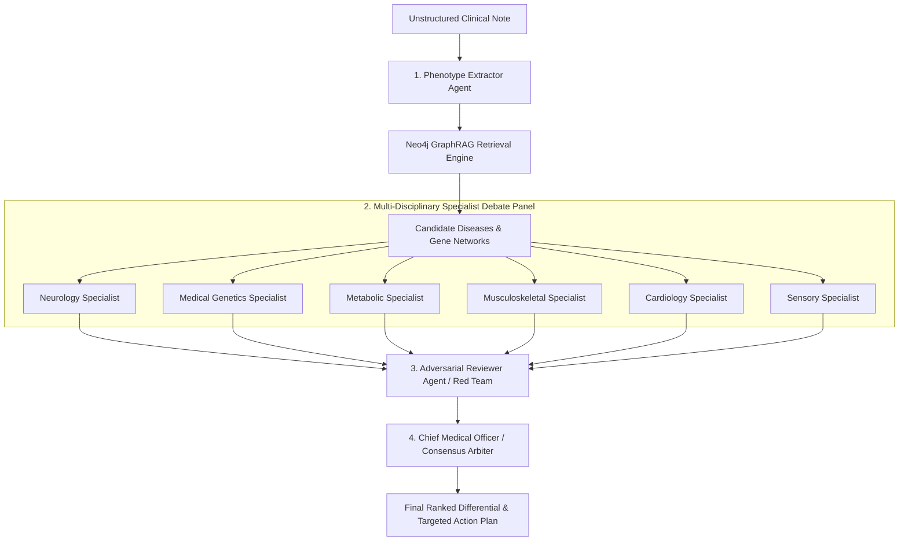

# Rare Disease Diagnostic Odyssey Solver 🧬

> **Multi-Agent GraphRAG Clinical Decision Support System for Rare Disease Diagnosis**  
> Combines structured biomedical ontologies (Human Phenotype Ontology, Orphanet) in **Neo4j** with a multi-specialist LLM debate panel orchestrated via **LangGraph**.

---

> ⚠️ **CLINICAL ADVISORY & DISCLAIMER**  
> This software is an investigational research prototype designed for clinical decision support and educational exploration. It is **not** a certified medical diagnostic device. All generated candidates, specialist findings, and recommendations must be critically reviewed and validated by licensed medical professionals.

---

## 🌟 Key Features

- **Automated Phenotype Extraction & Grounding**: LLM parses complex unstructured clinical notes, extracts positive and ruled-out findings with onset, and grounds them to Human Phenotype Ontology (HPO) terms via Neo4j fulltext Lucene search.
- **285,000+ GraphRAG Knowledge Network**: Evaluates candidates against a live Neo4j knowledge graph containing **12,880 Disease nodes** and **285,334 Disease-Phenotype (`HAS_PHENOTYPE`) annotations**.
- **IC-Weighted GraphRAG Scoring**: Calculates Information Content (IC) weighted disease matching with penalty deductions for contradictory/negated phenotypes.
- **Multi-Specialist LLM Panel Debate**: Parallel specialist agents (Neurology, Genetics, Metabolic, Musculoskeletal, Sensory, Cardiology) argue for and against top candidate diseases.
- **Adversarial Medical Reviewer & CMO Synthesis**: An adversarial reviewer checks citations against the knowledge graph and challenges weak arguments before the Chief Medical Officer synthesizes the final composite ranking.
- **Interactive 3-Tier Knowledge Graph**: Visualizes patient phenotypes $\rightarrow$ candidate diseases $\rightarrow$ causative genes with manual zoom (`+` / `-` / `Reset`), pan dragging, top 3 vs 5 selector, and node metadata inspector.
- **SSE Streaming & Glassmorphic UI**: Real-time stage-by-stage pipeline streaming with dark/light clinical frosted glass aesthetic, DM Serif typography, and zero emoji iconography (`lucide-react`).

---

## 🤖 Multi-Agent Architecture & Debate Panel

The system emulates a real-world **Rare Disease Tumor/Diagnostic Board** using coordinated LangGraph agent nodes:



### Agent Roles & Responsibilities

| Agent / Node | Role & Objective | Key Outputs |
| :--- | :--- | :--- |
| **1. Phenotype Extractor** | Parses raw clinical notes and standardizes terms to HPO identifiers (`HP:XXXXXXX`). Identifies negated findings (*"No seizures"*). | List of positive & absent HPO terms with onset, severity, and text evidence quotes. |
| **2. Graph Traverser (GraphRAG)** | Queries Neo4j across 285k+ associations to identify candidate diseases and calculate IC graph match scores. | Top 5 candidate diseases, gene links, and graph overlap scores. |
| **3. Specialist Panel** | 6 domain specialists (Neurology, Genetics, Metabolic, Musculoskeletal, Cardiology, Sensory) independently evaluate candidates. | Stance (`supports`/`refutes`/`neutral`), confidence (0–1), and HPO citations. |
| **4. Adversarial Reviewer** | Acts as "Devil's Advocate", challenging premature closure, finding missing hallmark signs, and highlighting phenotypic mismatches. | Structured clinical objections and severity ratings for top candidates. |
| **5. Chief Medical Officer (CMO)** | Synthesizes graph scores, specialist consensus, and adversarial penalties into a final calibrated ranking. | Final differential ranking score ($0.7 \times \text{Graph} + 0.3 \times \text{Panel} - \text{Penalty}$). |
| **6. Next Steps Planner** | Formulates targeted confirmatory lab tests, gene sequencing recommendations, and flags unexplained patient symptoms. | High-yield testing roadmap and clinical surveillance advisories. |

---

## 📋 Prerequisites

Ensure you have the following installed on your machine:

1. **Python 3.10+**
2. **Node.js 18+** and **npm**
3. **Neo4j Database**:
   - Option A (Recommended): [Neo4j AuraDB Free Cloud Instance](https://neo4j.com/cloud/aura/)
   - Option B: [Neo4j Desktop](https://neo4j.com/download/) or Docker (`neo4j:5.x`)
4. **LLM Provider API Key** (Any of the following):
   - **OpenRouter** (e.g., `openai:deepseek/deepseek-chat`) — Recommended
   - **Groq** (e.g., `groq:llama-3.3-70b-versatile`)
   - **OpenAI** (e.g., `openai:gpt-4o`)
   - **Anthropic** (e.g., `anthropic:claude-3-5-sonnet-20241022`)

---

## 🚀 Step-by-Step Installation & Setup

### Step 1: Clone the Repository

```bash
git clone -b Bhanu https://github.com/BhanuNama/Claude-Group-2.git
cd Claude-Group-2
```

---

### Step 2: Backend Setup

1. Navigate to the backend directory:
   ```bash
   cd backend
   ```

2. Create and activate a Python virtual environment:
   ```bash
   # Windows (PowerShell)
   python -m venv venv
   .\venv\Scripts\activate

   # macOS / Linux
   python3 -m venv venv
   source venv/bin/activate
   ```

3. Install required Python dependencies:
   ```bash
   pip install -r requirements.txt
   ```

4. Configure environment variables:
   Copy `.env.example` to `.env`:
   ```bash
   # Windows (PowerShell / CMD)
   copy .env.example .env

   # macOS / Linux
   cp .env.example .env
   ```

5. Edit `backend/.env` with your credentials:
   ```env
   # ── Neo4j Connection ─────────────────────────
   # If using Neo4j Aura Cloud:
   NEO4J_URI=neo4j+ssc://<your-instance-id>.databases.neo4j.io
   NEO4J_USER=neo4j
   NEO4J_PASSWORD=your_neo4j_password

   # ── LLM Configuration (OpenRouter Example) ──
   LLM_MODEL=openai:deepseek/deepseek-chat
   OPENAI_API_BASE=https://openrouter.ai/api/v1
   OPENAI_API_KEY=sk-or-v1-xxxxxxxxxxxxxxxxxxxxxxx
   ```

---

### Step 3: Populate the Neo4j Knowledge Graph (One-Time Setup)

If connecting to an existing populated Neo4j instance, you can skip this step. Otherwise, download the raw ontology files into `backend/data/`:

1. **HPO Ontology**: Download `hp.obo` from [HPO Releases](https://hpo.jax.org/data/ontology) $\rightarrow$ save as `backend/data/hp.obo`.
2. **HPO Annotations**: Download `phenotype.hpoa` from [HPO Annotations](https://hpo.jax.org/data/annotations) $\rightarrow$ save as `backend/data/phenotype.hpoa`.
3. **Orphanet Genes**: Download `en_product6.xml` from [Orphadata Products](https://www.orphadata.com/genes/) $\rightarrow$ save as `backend/data/en_product6.xml`.

Execute the ingestion pipeline:
```bash
python -m loader.setup_indexes
python -m loader.load_hpo
python -m loader.load_genes
python -m loader.load_annotations
python -m loader.compute_ic
```

---

### Step 4: Validate Backend & Start Server

To run the end-to-end integration test from CLI:
```bash
python test_full_graph.py
```

Start the FastAPI backend:
```bash
# Windows / macOS / Linux
python -m uvicorn app.main:app --host 0.0.0.0 --port 8000 --reload
```
- API live at: `http://localhost:8000`
- Interactive Swagger docs: `http://localhost:8000/docs`

---

### Step 5: Frontend Setup & Launch

1. Open a new terminal and navigate to the `frontend` directory:
   ```bash
   cd frontend
   ```

2. Install dependencies:
   ```bash
   npm install
   ```

3. Start the Vite development server:
   ```bash
   npm run dev
   ```

4. Open your browser:
   ```
   http://localhost:5173
   ```

---

## 🧪 Sample Clinical Case for Testing

Paste the following clinical case into the input area in the UI:

```text
6-year-old boy. Progressive muscle weakness since age 3, very high CK level (markedly elevated creatine kinase), delayed speech and language development, sensorineural hearing loss in both ears. Calf pseudohypertrophy noted on examination. No seizures. No cardiac involvement at this time. Family history: maternal uncle had similar symptoms, wheelchair-bound by age 12.
```

Click **Run Diagnostic Pipeline** to see the real-time extraction, specialist debate, and final ranking.

---

## 🧭 UI Features & Controls

- **Overview & Differential Tab**:
  - **Horizontal Phenotype Grid**: Confirmed positive findings (green) and ruled-out findings (red strikethrough) with anatomical system badges and clinical evidence snippets.
  - **Ranked Differential List**: Compact cards with composite diagnostic scores, matching HPO counts, 3-metric score breakdown cards, expandable specialist findings, and reviewer objection callouts.
  - **Recommended Next Steps**: High-yield confirmatory tests and unexplained patient features.
- **Specialist Debate Tab**:
  - Dual view modes (*By Disease* & *By Specialty*), confidence meters, and HPO citations.
- **Knowledge Graph Tab**:
  - **Manual Zoom Controls**: **`+`** (Zoom In), **`-`** (Zoom Out), **`Reset`** (Fit View) with mouse-wheel zoom hijacking disabled.
  - **Canvas Pan & Drag**: Smooth panning across the 3-tier layout (Phenotypes $\rightarrow$ Diseases $\rightarrow$ Genes).
  - **Node Inspector**: Click any node to open the metadata inspection drawer.

---

## 📡 API Endpoints

| Endpoint | Method | Description |
|---|---|---|
| `/v1/diagnose` | `POST` | Executes the complete diagnostic graph synchronously |
| `/v1/diagnose/stream` | `POST` | SSE stream yielding real-time node outputs & debate updates |
| `/v1/cases/{thread_id}` | `GET` | Retrieves saved diagnostic state and history |
| `/v1/health` | `GET` | Verifies connectivity to Neo4j and LLM provider |

---

## 📂 Repository Structure

```
Claude-Group-2/
├── .gitignore
├── README.md
├── backend/
│   ├── app/
│   │   ├── main.py          # FastAPI application & SSE endpoints
│   │   ├── graph.py         # LangGraph state graph definition
│   │   ├── nodes.py         # 6 LangGraph agent nodes & prompt templates
│   │   ├── schemas.py       # Pydantic data models & state schemas
│   │   ├── queries.py       # Cypher queries for Neo4j
│   │   ├── scoring.py       # Deterministic scoring algorithms
│   │   ├── guardrails.py    # Citation verification & validation
│   │   └── config.py        # System configuration & weights
│   ├── loader/              # Neo4j data ingestion scripts
│   ├── test_full_graph.py   # End-to-end integration test
│   ├── requirements.txt
│   └── .env.example
└── frontend/
    ├── src/
    │   ├── App.jsx          # Root application layout & tabs
    │   ├── components/      # React components (GraphVisualization, SpecialistDebate, etc.)
    │   ├── hooks/           # useAnalysis SSE hook & state management
    │   ├── utils/           # API utilities & helpers
    │   └── index.css        # Clinical glassmorphism styling
    ├── package.json
    └── vite.config.js
```

---

## 🤝 Git Workflow & Submitting Pull Requests

To create a Pull Request to merge your changes into `main`:

```bash
# 1. Ensure you are on branch Bhanu and all changes are committed
git checkout Bhanu
git add .
git commit -m "feat: complete multi-agent GraphRAG rare disease diagnostic solver"

# 2. Push to origin Bhanu
git push origin Bhanu

# 3. Open GitHub and create a Pull Request:
#    Base repository: main  <---  Compare: Bhanu
```

---

## 📄 License & Citations

- **Human Phenotype Ontology (HPO)**: Available under the [HPO License](https://hpo.jax.org/).
- **Orphanet / Orphadata**: Freely accessible for non-commercial research with attribution.
